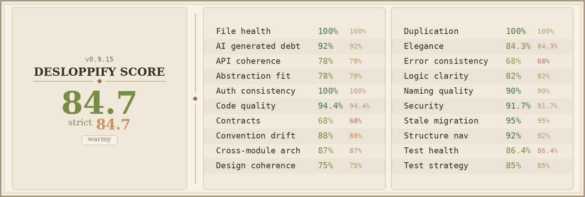

# Warmy

**Never wait for your Claude Code or Codex CLI session to come back.**

You know that feeling. You sit down to ship something, type a prompt, and get hit with *"You've reached your rate limit. Try again at 4:23pm."* Three hours of dead time you didn't ask for.

Warmy fixes that. It quietly watches your 5-hour rate-limit window, waits for it to expire, then fires a tiny ping to start a fresh one. By the time you come back to your terminal, the window is already open and waiting for you.

## Why Warmy

Claude Code and Codex CLI both use a **rolling 5-hour rate-limit window**. The clock starts the moment you fire your first request, and the only way to get a new window is to wait for the old one to expire and then send another request. Skip that second step and you're locked out until you happen to type something hours later.

Warmy automates the second step. It does one thing well:

1. Reads your real API history from `~/.claude/history.jsonl` and `~/.codex/logs_1.sqlite`.
2. Figures out exactly when your current 5-hour window expires.
3. Sends a single warmup ping 1 minute after expiry by invoking `claude -p` / `codex exec` directly — the same auth path your real sessions use, so the ping actually counts toward the new window.

If you're actively coding within 10 minutes of the reset, Warmy stays out of your way. Your own activity already refreshed the window.

## Install

```bash
npm install -g @codelined/warmy
warmy init
```

That's it. `init` detects which CLIs you have installed, installs the scheduler, and starts the background daemon. Reboot whenever you want, the daemon comes right back.

## Quick start

```bash
warmy init      # interactive setup
warmy status    # see what Warmy is doing right now
warmy run       # force a warmup attempt
warmy upgrade   # pull the latest version from npm
```

## How it actually runs

Warmy is a long-lived background daemon. It polls every **30 seconds** and only fires a real warmup when your window has just expired. The 30s cadence lets Warmy hit the right moment instead of waiting on the next 5-minute cron tick. Each tick reads `~/.claude/history.jsonl` and runs a couple of `sqlite3` queries against the Codex log, then exits if there's nothing to do, so the cost is negligible on any modern machine.

| Platform | What gets installed | Auto-restart | Reboot persistence |
|----------|---------------------|--------------|--------------------|
| macOS    | `launchd` plist with `KeepAlive=true` and `RunAtLoad=true` | yes (launchd respawns) | yes (loads on login) |
| Linux    | cron `@reboot warmy ensure-daemon` plus a 1-minute `ensure-daemon` watchdog | yes (watchdog respawns) | yes (cron starts at boot) |

No `loginctl enable-linger`. No systemd unit files. No surprises.

The daemon writes its PID to `~/.warmy/daemon.pid` and refuses to start a second instance. Output goes to `~/.warmy/daemon.log`. Failed warmups (expired token, network blip) trigger a 5-minute backoff so Warmy never hammers the API.

## Commands

| Command | What it does |
|---------|--------------|
| `warmy init` | Interactive setup. Installs the scheduler, starts the daemon. |
| `warmy status` | Config, scheduler, daemon PID, next warmup time. |
| `warmy run` | Run a single warmup check now. Useful for debugging. |
| `warmy daemon` | Run the polling loop in the foreground. Used by the scheduler. |
| `warmy ensure-daemon` | Start daemon unless explicitly stopped. Cron watchdog hook; will not override `stop-daemon`. |
| `warmy start-daemon` | Force-start the daemon, clearing any stop marker. |
| `warmy restart-daemon` | Stop the running daemon, clear the stop marker, and start fresh. |
| `warmy stop-daemon` | Stop the daemon and prevent the watchdog from restarting it. |
| `warmy upgrade` | Pull `@codelined/warmy@latest` from npm. Leaves config alone. |
| `warmy set-message "..."` | Customize the warmup message. |
| `warmy edit-config` | Open `~/.warmy/config.json` in `$EDITOR`. |
| `warmy uninstall` | Stop daemon, remove scheduler, wipe config and tokens. |

## Customizing the warmup message

```bash
warmy set-message "Hey Claude, just keeping the session warm."
```

Both Claude Code and Codex receive this exact message during warmup. The default is `"Hey Claude, just warming up the session. How's it going?"`.

## Upgrading

```bash
warmy upgrade
```

Pulls the latest version globally and never touches `~/.warmy/config.json`. By default, `warmy upgrade` also restarts the running daemon so the new code takes effect immediately. Pass `--no-restart` if you want to handle that yourself:

```bash
warmy upgrade --no-restart
warmy restart-daemon
```

## Troubleshooting

**"Refusing to use ~/.warmy: owner uid 0 != ours ..."** — you ran `warmy` with `sudo` at some point and the directory ended up root-owned. Fix:

```bash
sudo chown -R $USER ~/.warmy
```

**Logs** — the daemon writes to `~/.warmy/daemon.log` and rotates at 5 MB, keeping `daemon.log.1`, `.2`, `.3`. The cron watchdog logs to `~/.warmy/cron.log`.

## How warmups happen

Warmy doesn't speak to the Anthropic or OpenAI APIs directly. It shells out to your installed `claude` / `codex` binary in non-interactive mode (`claude -p --model claude-haiku-4-5 ...` and `codex exec --ephemeral --skip-git-repo-check --sandbox read-only ...`). That means:

- Auth refresh is handled by the CLI you already use — Warmy never touches your tokens.
- The warmup goes through your subscription path, so it counts toward the same 5-hour window as your real sessions.
- If you're signed out or your token is dead, the warmup fails the same way `claude -p` fails interactively, with the CLI's own error message.

## Requirements

- Node.js 18 or newer
- [Claude Code](https://docs.anthropic.com/en/docs/claude-code) or [Codex CLI](https://github.com/openai/codex) (or both) installed and signed in
- macOS (launchd) or Linux (cron) for the scheduler

---

## Quality metrics


